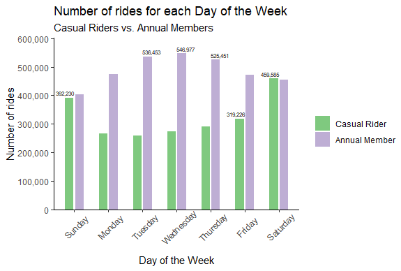
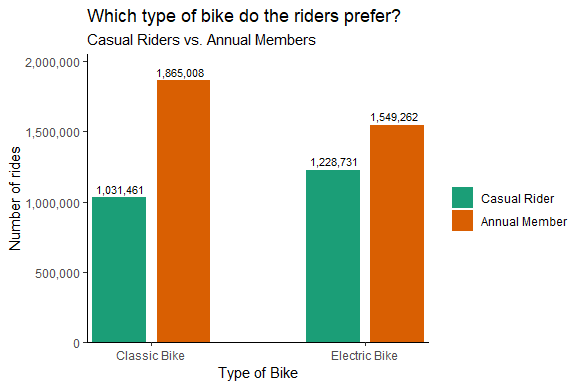
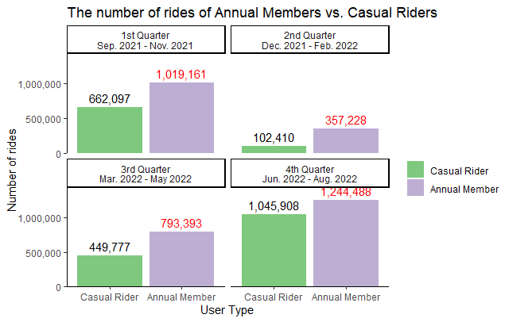

# Exploration and visualization of Cyclistic’s yearly trip data

This case study was conducted for the purposes of “Google Data Analytics Capstone Project”, which is part of the “Google Data Analytics Professional Certificate”. Cyclistic is a fictional company based in Chicago.  In the study data analysis is performed on yearly trip data and clear data visualizations are created in order to understand how casual riders and annual members use Cyclistic bikes differently. The data used for the purposes of this case study are made available from Motivate International Inc. 

The full report of the case study is in [Exploration and visualization of Cyclistic’s yearly trip data](https://sites.google.com/view/angelobompotasportfolio/my-projects/exploration-and-visualization-of-cyclistics-yearly-trip-data).

## Table of Contents

- [Data](#data)
- [images](#images)
- [Data Cleaning](#data-cleaning) 
  - [cleaning_cyclistic_data.ipynb](#cleaning_cyclistic_dataipynb)
  - [cyclistic_cleaning_changelog.Rmd](#cyclistic_cleaning_changelogrmd)
- [unzip_cyclistic_data.py](#unzip_cyclistic_datapy)
- [Analyzing](#analyzing)
  - [cyclistic_tripdata.R](#cyclistic_tripdatar)
  - [Analysis_of_Cyclistic's_yearly_trip-data.Rmd](#analysis_of_cyclistics_yearly_trip-datarmd)
- [Recommendations](#recommendations)

  
 <h3>Data</h3> 

The Data folder contains the Cyclistic's yealy trip data from the SQL database. The data are cleaned and ready to use in the analysis process. They are zipped and stored in eleven different volumes.
  

  
 <h3>images</h3> 

In the images folder they are stored .png files showing the queries from the SQL server used to clean the data. It, also, contains the figures which were produced from the analysis using the r programming language. The same figures can be created from the [cyclistic_tripdata.R](https://github.com/Angelo-Bobotas/Cyclistic_bike-share_analysis/blob/main/cyclistic_tripdata.R) and [Analysis_of_Cyclistic's_yearly_trip-data.Rmd](https://github.com/Angelo-Bobotas/Cyclistic_bike-share_analysis/blob/main/Analysis_of_Cyclistic's_yearly_trip-data.Rmd) files. In addition, there is an image file that was created using the Tableau application.

  
 <h3>Data Cleaning</h3> 

 <h4>cleaning_cyclistic_data.ipynb</h4> 

The [cleaning_cyclistic_data.ipynb](https://github.com/Angelo-Bobotas/Cyclistic_bike-share_analysis/blob/main/cleaning_cyclistic_data.ipynb), notebook, explains the cleaning procedure that was followed. More specifically, it presents the SQL queries that were used in the SQL server, the reason behind each query and discusses the final results.
  

  
 <h4>cyclistic_cleaning_changelog.Rmd</h4> 

[cyclistic_cleaning_changelog.Rmd](https://github.com/Angelo-Bobotas/Cyclistic_bike-share_analysis/blob/main/cyclistic_cleaning_changelog.Rmd) file contains the notable cleaning and manipulation of data. It logs all the steps taken from the initial raw data until the final clean dataset. 

  

  
 <h3>unzip_cyclistic_data.py</h3> 

This is a small python script that can be used to extract the .csv file with the data from the zipped files stored in the Data folder.
  

  
 <h3>Analyzing</h3> 

  
 <h4>cyclistic_tripdata.R</h4> 

In the [cyclistic_tripdata.R](https://github.com/Angelo-Bobotas/Cyclistic_bike-share_analysis/blob/main/cyclistic_tripdata.R) file it is stored all the R code used for the analysis and visualization of the data. 
  

  
 <h4>Analysis_of_Cyclistic's_yearly_trip-data.Rmd</h4> 

The same code can be found in the [Analysis_of_Cyclistic's_yearly_trip-data.Rmd](https://github.com/Angelo-Bobotas/Cyclistic_bike-share_analysis/blob/main/Analysis_of_Cyclistic's_yearly_trip-data.Rmd) but this .Rmd file discribes in more detail each step using the R Markdown syntax.
  

  

### Recommendations

The analysis was able to identify trends from the historical data and also answer the critical question of how casual rides use Cyclistic bikes differently compare to the annual members. Now, the new information can be exploited and new data-driven recommendations can be formulated aiming at converting casual riders into annual members.

First of all, it is very critical to present Cyclistic bike-share program as a way of using bicycles as the main mean of transportation to every day work. As the analysis showed annual members tend to use bikes more often during the middle of the week, in contrast casual riders prefer to use bikes during the weekend. So, promoting how Cyclistic bike-share program can be used for going to work can eventually persuade casual rider to purchase an annual membership.

In conjunction with the previous strategy, promoting the plethora of electric bikes the program offers would have an even bigger impact in converting casual riders to members. This springs from the fact that casual riders prefer electric bikes over the classic ones.

Last but not least, it is very important to start the campaign in the end of the winter and start of the spring, i.e., between February and March. The reason for that is that this is when bike rides would probable start increasing, as the seasonal analysis showcased.

It is very important to note that this analysis needs to continue to be conducted in short periods of time, maybe yearly or biannual, in order to keep track of the latest changes in the customers’ behavior. Even more, further data are needed from surveys or other methods in order to acquire a more complete and holist profile of the Cyclistic’s customers and explore what they like and dislike about the program. Also, it is important the percentages of different groups, such as the males and females or people with disabilities, that constitute the hole of Cyclistic’s customers to be identified so that new approaches and marketing strategies can be created in light of these new insights.
